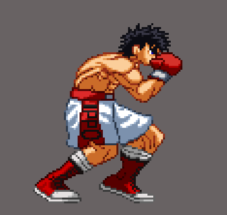

  <!-- Header Animado - Typing SVG -->
  

  

    ⚡ <b>Sistemas Embarcados (C / C++ / C#)</b> | 🎮 <b>Desenvolvimento de Jogos</b> | 🤖 <b>Python & IA Financeira</b> | 🌐 <b>Linux & AWS</b>
  

  

    
    
  

---

## 🔬 Sobre Mim & Foco de Carreira

<table>
  <tr>
    <td valign="top" width="70%">
      <ul>
        <li>📟 <b>Sistemas Embarcados & Hardware:</b> Programação de baixo nível e integração utilizando <b>C</b>, <b>C++</b> e <b>C#</b> em ecossistemas com <b>ESP32</b>, <b>Arduino</b>, sensores, atuadores e comunicação sem fio.</li>
        <li>🎮 <b>Desenvolvimento de Jogos:</b> Criação de jogos na <b>Godot Engine</b> com <b>C#</b> e <b>C++</b>, foco em <b>otimização multiplataforma</b>, arquitetura de sistemas escaláveis, mecânicas de gameplay e física.</li>
        <li>🤖 <b>Python & IA no Mercado Financeiro:</b> Entusiasta de Inteligência Artificial aplicada, conectando tecnologia ao setor financeiro para análise estratégica de dados e investimentos.</li>
        <li>🌐 <b>Infraestrutura, Redes & Nuvem:</b> Administração de sistemas <b>Linux</b>, arquitetura de redes e serviços em nuvem <b>AWS</b>.</li>
      </ul>
    </td>
    <td align="center" valign="middle" width="30%">
       
      Arte do sprite por <a href="https://xhienx.artstation.com/projects/4brzVn" target="_blank">xhienx</a>
    </td>
  </tr>
</table>

---

## 🚀 Projeto em Destaque (Principal)

### 📈 [INvest](https://github.com/tavrocha/INvest)
> **Integração entre Mercado Financeiro, IA e Tecnologia**

Uma solução desenvolvida em **Python** que conecta dados do mercado financeiro a modelos de Inteligência Artificial para análise avançada de investimentos, geração automática de insights e tomada de decisão estratégica.

---

## 🛠️ Minha Caixa de Ferramentas (Tech Stack)

| 📟 Embarcados, C, C++ & C# | 🎮 Desenvolvimento de Jogos |
| :--- | :--- |
|         |       |

| 🐍 Python & IA Financeira | 🌐 Infra, Redes & Dados |
| :--- | :--- |
|      |       |

---

## 🎮 Laboratório de Projetos

<table align="center" width="100%">
  <tr>
    <td width="50%" valign="top">
      <h3 align="center">📟 Embarcados & Hardware</h3>
      <ul>
        <li><b>Low-Level em C / C++:</b> Otimização de recursos, manipulação direta de registradores e firmware.</li>
        <li><b>ESP32 & Arduino:</b> Projetos de telemetria, sensores, atuadores, Wi-Fi e Bluetooth.</li>
        <li><b>Softwares de Suporte em C#:</b> Desenvolvimento de ferramentas desktop de monitoramento e controle.</li>
      </ul>
    </td>
    <td width="50%" valign="top">
      <h3 align="center">🎮 Desenvolvimento de Jogos</h3>
      <ul>
        <li><b>Engenharia no Godot Engine:</b> Lógica de alta performance integrada com C# e C++ (GDExtension).</li>
        <li><b>Otimização Multiplataforma:</b> Gestão de recursos, memória e desempenho para diferentes plataformas.</li>
        <li><b>Arquitetura & Gameplay:</b> Estruturação de sistemas de jogo, física, mecânicas interativas e IA de comportamento.</li>
      </ul>
    </td>
  </tr>
</table>

---

## 📊 Estatísticas do GitHub

  
  

---

  <i>"A melhor maneira de prever o futuro é inventá-lo."</i> 
  <b>Aberto a novas oportunidades e colaborações! 🚀</b>
    
  

